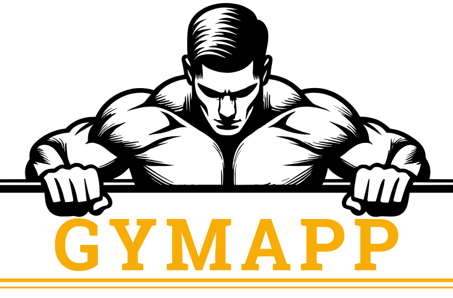

## Description

GymApp est une plateforme de gestion pour les salles de sport, permettant aux propriétaires d'enregistrer leurs établissements afin de suivre les abonnements, les séances d'entrainements, le stock, et les ventes. L'application propose un tableau de bord interactif pour visualiser les statistiques et simplifier la gestion quotidienne. Elle est conçue pour être intuitive et adaptée aux besoins des petites et grandes salles de sport.

## Fonctionnalités

- Gestion des abonnements
- Gestion des séances
- Gestion de stock
- Gestion des ventes
- Gestion de la clientèle
- Gestion des managers
- Gestion des évènements
- Génération de factures
- Tableaux de bords

## Premiers pas
- Enregistrez votre salle de gym et créer un Super-Utilisateur
- Choisissez une formule adaptée aux besoins de votre salle de gym et finalez le paiement
- Connectez-vous ! 
- Configurez vos forfaits d'abonnements et de séances
- Créez vos managers, attribuez leurs rôles et définissez leurs permissions
- **Exploitez pleinement l'application !** 

## Documentation

Accédez rapidement aux sections détaillées de notre documentation pour une compréhension complète des fonctionnalités de notre application.

- [Gestion des managers](docs/manager.md)
- [Gestion des forfaits](docs/package.md)
- [Gestion des abonnements](docs/subscription.md)
- [Gestion des séances](docs/session.md)
- [Gestion de Stock](docs/product.md)
- [Système de vente](docs/sale.md)
- [Gestion de la clientèle](docs/customer.md)
- [Gestion des évènements](docs/event.md)
- [Réabonnement au service GymApp](docs/payment.md)

## Auteurs

- [Goïta Cheick](https://www.github.com/Chesterkxng), *Développeur*.

## Contributeurs

- [Keglo Stephane](https://www.github.com/keglostephane), *Développeur*
- [Zoum Lewis](https://www.facebook.com/ouattara.zoumanalewiis), *Infographiste*

